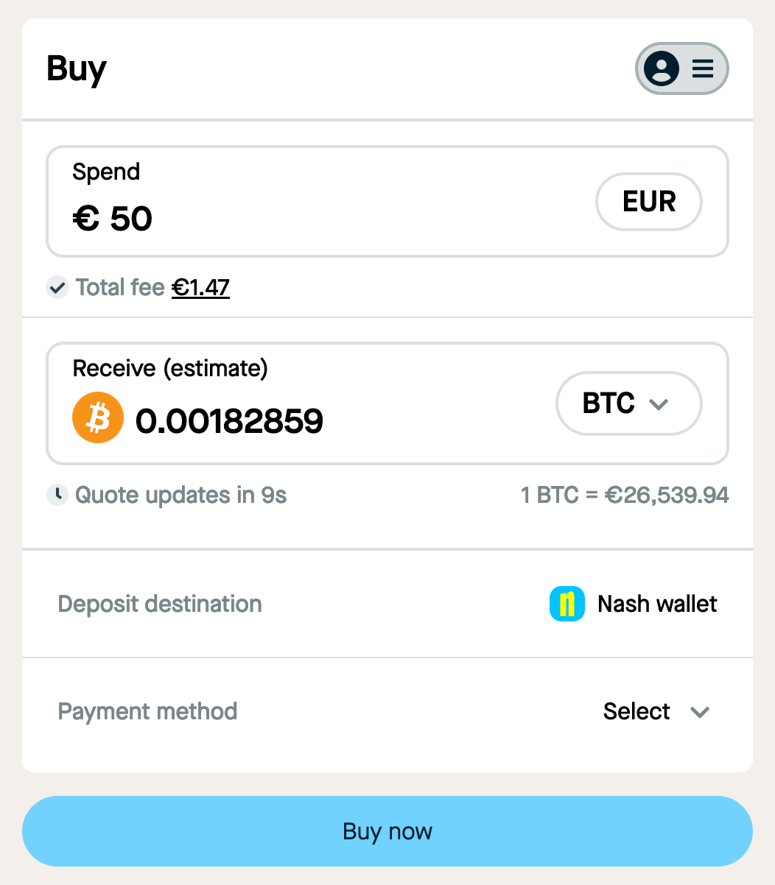

# `ramp-widget-sdk`

A JavaScript library to allow third-parties to include a Nash fiat ramp widget in any webpage.

The widget is basically a way to calculate rates for buying crypto, and then generate a link to complete the purchase, which leads to the Nash mobile app. The link is either encoded into a QR code in desktops, or turned into a button in mobile devices.



## Getting started

### npm module

#### Install

```bash
# npm
npm install @nash-io/ramp-widget-sdk

#yarn
yarn add @nash-io/ramp-widget-sdk
```

#### Embed

Your page must contain an HTML element with the following data attribute: `data-nash-fiat-ramp-widget`:

```html
<div data-nash-fiat-ramp-widget />
```

Once initializing the widget like below, an `iframe` pointing to the widget deployment will be loaded within your HTML element:

```js
// import the module
import NashRamp from "@nash-io/ramp-widget-sdk";

// initialize the widget
const nashWidget = new NashRamp({
  base: "eur", // The symbol of the fiat currency to be used in the purchase.
  destination: "0x06e97748AD4E0A36490F92733EF95D8490ffD97f", // The wallet address where the purchased crypto should be sent to. Note that this must be valid with the provided `target`.
  env: "PRODUCTION", // points to the environment where the widget is deployed; either 'LOCAL' or 'PRODUCTION'
  redirect: "https://example.com", // URL to be redirected after the purchase is complete.
  referrer: "MyApp", // Your webapp name (will be displayed in the complete purchase step).
  target: "aave", // The symbol of the crypto currency to be purchased.
});

nashWidget.init({
  width: 496, // Widget width: any valid CSS value — use 100% for responsiveness
  height: 480, // Widget height: any valid CSS value — anything under 480px won't work well
  onClose: () => console.log("close!"), // When provided, a ❌ button will be rendered over the widget. When clicking the ❌, this function is called. Useful if you're rendering the widget within your own modal and want to use this button for closing the modal.
});
```

#### With React

The pattern above can be reproduced in a simple React component:

```jsx
import React, { useEffect } from "react";
import NashRamp from "@nash-io/ramp-widget-sdk";

const NashRampWidget = ({
  base,
  destination,
  env,
  target,
  redirect,
  referrer,
}) => {
  useEffect(() => {
    const nash = new NashRamp({
      base,
      destination,
      env,
      redirect,
      referrer,
      target,
    });
    nash.init({
      width: 496,
      height: 480,
    });
  }, []);
  return <div data-nash-fiat-ramp-widget />;
};

export default NashRampWidget;
```

And then used anywhere:

```jsx
export default () => (
  <NashRampWidget
    base="eur"
    destination="0x06e97748AD4E0A36490F92733EF95D8490ffD97f"
    env="PRODUCTION"
    redirect="https://example.com/"
    referrer="MyApp"
    target="aave"
  />
);
```

### Browser (UMD module)

```html
<!-- embed the script -->
<script
  src="https://raw.githubusercontent.com/nash-io/ramp-widget-sdk/master/dist/ramp-widget-sdk.umd.js"
  async
></script>

<body>
  <!-- initialize -->
  <script>
    function initializeNash() {
      const nash = new NashRamp({
        base: "eur",
        destination: "0x06e97748AD4E0A36490F92733EF95D8490ffD97f",
        env: "PRODUCTION",
        redirect: "https://example.com",
        referrer: "MyApp",
        target: "aave",
      });
      nash.init({
        width: "480px",
        height: "480px",
        onClose: () => console.log("close!"),
      });
    }
    window.onload = function () {
      initializeNash();
    };
  </script>
  <!-- HTML target -->
  <div data-nash-fiat-ramp-widget />
</body>
```
